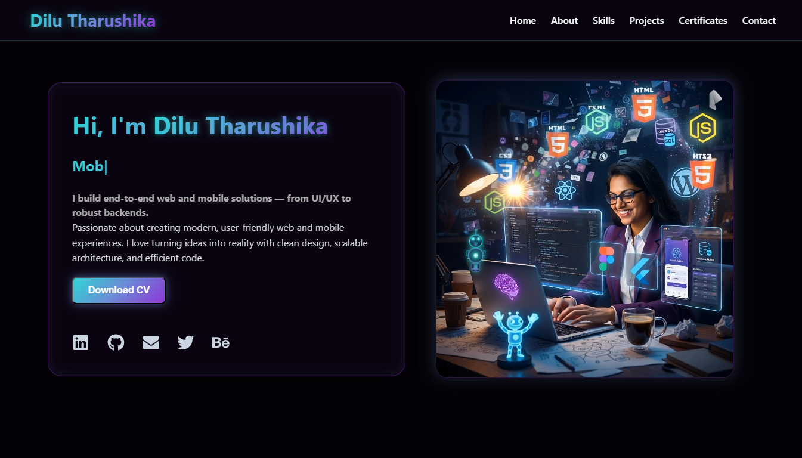
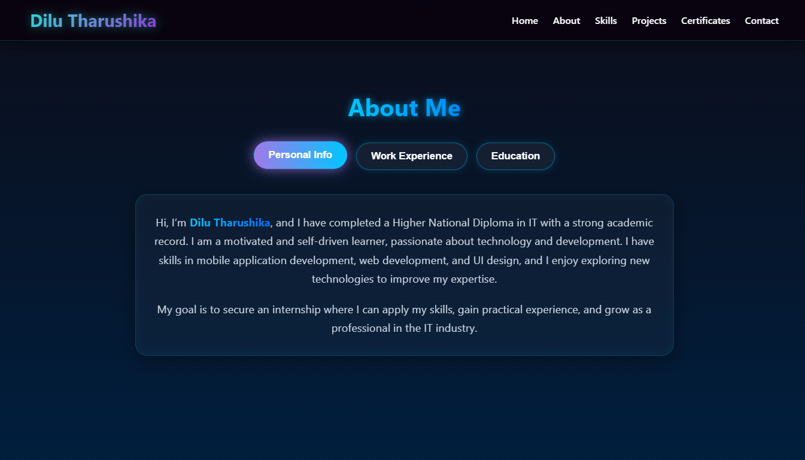
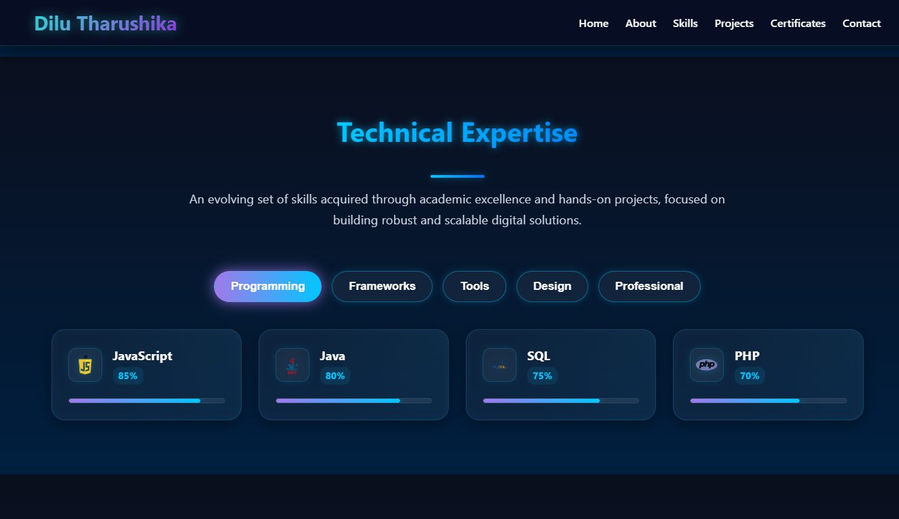
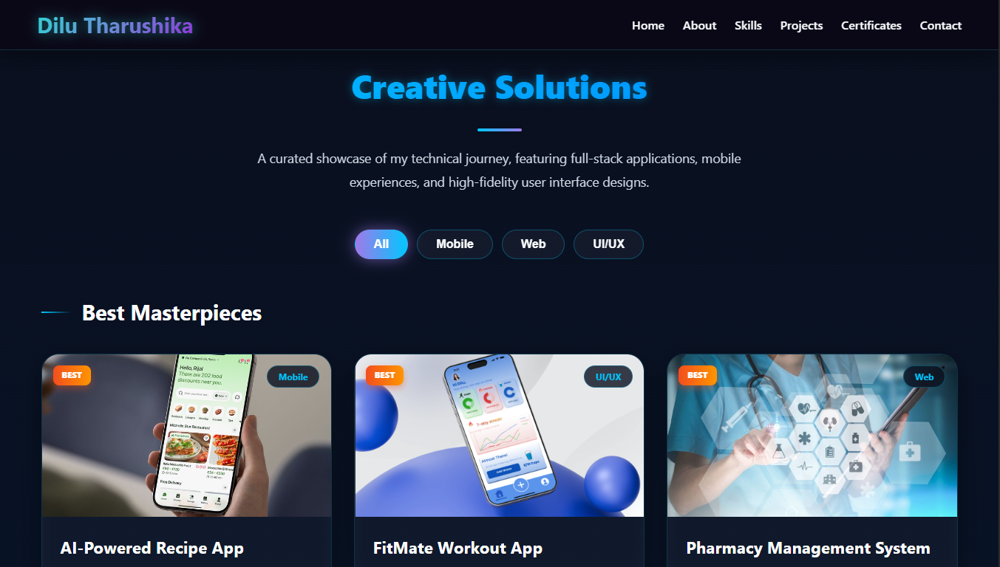

# 🌐 Personal Portfolio Website

A modern and responsive personal portfolio website built using **React.js** to showcase my projects, skills, and experience as an IT undergraduate and developer.

🔗 Live Demo: https://dilutharushika.github.io/my-portfolio/

---

## 🚀 Features

- 🏠 Home section with introduction  
- 👩‍💻 About Me section  
- 🛠 Skills showcase  
- 📂 Projects portfolio  
- 📱 Fully responsive design  
- 🎨 Clean and modern UI  

---

## 🖼️ Screenshots

### 🏠 Home Page


### 👩‍💻 About Section


### 🛠 Skills Section


### 📂 Projects Section


---

## 🛠️ Technologies Used

- **React.js** – Frontend Development  
- **JavaScript (ES6+)**  
- **HTML5 & CSS3**  
- **Vite / npm** – Project setup and build tools  

---

## ⚙️ Installation & Setup

1. Clone the repository:
```bash
git clone https://github.com/Dilu-Tharushika/my-portfolio.git